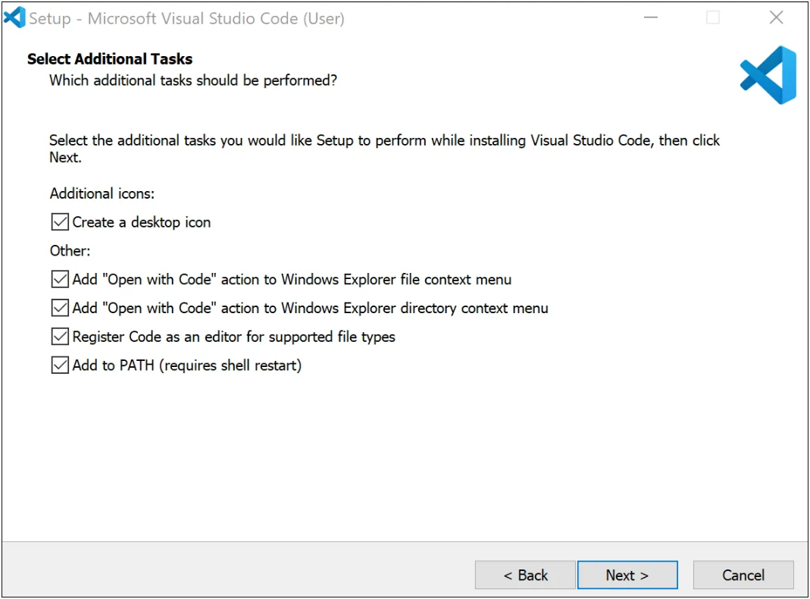

## 1. Вступ

Привіт! 😊 У цьому модулі ти познайомишся з основами мови програмування **Javascript** та навчишся розв'язувати прості алгоритмічні задачі.

Якщо ти бажаєш повторювати код з відеоуроків, будь ласка, встанови **Visual Studio Code**. У відео ти знайдеш деякі поради щодо використання VSCode. Редактор на платформі працює так само, тому ти можеш використовувати ті ж команди в ньому.

### Встановлення VSCode на MacOS

Якщо у тебе комп'ютер або ноутбук з **macOS**, просто завантаж [VSCode](https://code.visualstudio.com/docs/?dv=osx), **розпакуй** його та **запусти**.

### Встановлення VSCode на Windows

Якщо у тебе **Windows**, виконай наступні кроки:

1. Завантаж [VSCode](https://code.visualstudio.com/docs/?dv=win).
2. Запусти файл як завжди (**НЕ** як Адміністратор).
3. Продовжуй до кроку **Select Additional Tasks**.
4. Обери наступні опції:

- **Add "Open with Code" action...** дозволяє тобі відкривати файли та папки з контекстного меню (правою клавішею);
- **Register Code...** відкриватиме підтримувані файли в VSCode після подвійного кліку;
- **Add to PATH** дозволяє запустити VSCode з **Терміналу** за допомогою команди `code`.

## 

<!-- https://snipboard.io/BKj0Jb.jpg -->

---

## 2. Основні поняття

Комп’ютерна програма — це текстовий файл, який містить послідовність команд для комп’ютера. Існує багато мов програмування. Кожна з них вимагає від програміста дотримуватись певних правил при написанні програми, щоб комп’ютер зрозумів, як її виконати. Ми з вами будемо вивчати мову Javascript та її правила.

### Команди

Усі програми складаються з команд, якими ти можеш «спілкуватися» з комп’ютером.

Наприклад, `console.log()` використовується для виведення повідомлень у консоль (натисни `F12` та обери закладку `Console`, щоб побачити її, там вже може бути багато повідомлень 😊):

```css
console.log('Hello, world!');
```

**Зверни увагу:** кожну команду завершуй символом `;` — так комп’ютер точно знатиме, що це кінець твоєї команди.

### Коментарі

Коментар — це пояснювальний текст до програми. Він не виконується комп’ютером, а просто допомагає програмісту краще зрозуміти логіку програми.

Коментарі бувають однорядковими та багаторядковими.

Однорядкові коментарі позначаються двома символами слеша `//`. Наприклад:

```css
// надрукуємо в консолі фразу 'Hello, world!'
console.log('Hello, world!');
```

Багаторядкові коментарі позначаються символами `/*` на початку та `*/` в кінці. Наприклад:

```css
/* це багаторядковий коментар
цей рядок не надрукується
і цей теж */
console.log('Hello, world!');
```

### Літерали

Усі програми працюють із даними, наприклад, числами або рядками. Для запису даних використовуються літерали.

Числовий літерал складається з цифр, перед цифрами може стояти знак `-`, якщо число від'ємне, а між цілою та дробовою частинами може стояти `.` Числа пишуться без лапок: `42`, `-5`, `3.14`.

Літерал рядка завжди пишеться в лапках: `'Misha'`, `'Hello, world!'`.

### Змінні

Змінні використовуються для зберігання даних. По суті, це коробка з назвою, у яку ми можемо щось покласти, а потім дістати та використовувати далі у своїй програмі.

Щоб записати у змінну значення, використовується оператор присвоювання — `=`.

У JavaScript ти можеш створювати змінні за допомогою цих двох ключових слів: `let` та `const`.

Розглянемо приклади:

```css
// цій змінній пізніше можна присвоїти інше значення
let age = 37;

// запишемо нове значення
age = 38;

console.log(age); // ми побачимо 38

// цій змінній присвоїти інше значення не вийде
const name = 'Misha';

name = 'Petya'; // видасть помилку
```

**Зверни увагу:** назва змінної має пояснювати, які дані будуть в ній зберігатися. Тому напиши одне або декілька слів англійською мовою, перше слово з маленької літери, а решту — з великої. Також інколи використовують цифри (всередині назви) та символи `_` та `$`.

Наприклад:

```css
// хороша назва
const cookiePrice = 15;

// погані назви
const cookie_price = 15; // в деяких інших мовах так пишуть, але в Javascript так не прийнято
const priceof1cake = 25; // важко бачити межі слів
const value = 15; // бо не пояснює, що за value
```

### Вирази

В програмі ми часто щось обчислюємо. Для цього змінні та літерали поєднуються за допомогою операторів. Наприклад:

```css
const radius = 10;
const circleSquare = 3.14 * radius * radius;

console.log(circleSquare); // 314
```

Щоб обчислити значення виразу, потрібно:

Підставити замість змінних їх значення.
Виконати вказані дії.
Наприклад:

```css
// оголосимо змінну cookiePrice і присвоїмо їй значення 15
const cookiePrice = 15;

console.log(20 - cookiePrice); // 5
```

Розглянемо ще один приклад:

```css
const price = 25;
const amount = 5;
const discount = 10;
const result = price * amount — discount;

console.log(result); // 115
```

---

## 3. Типи даних

Усі значення в Javascript мають певний тип даних. Він визначає, які команди можна виконувати з тими чи іншими значеннями. Наприклад, над числами можна здійснювати математичні операції (додавати, множити, ділити тощо), а рядки можна «склеювати» (конкатенувати) та брати їх частину чи окремі символи.

Розглянемо типи даних Javascript.

### Числа

Всі числа (цілі та дробові) належать до типу `number`.

Наприклад:

```css
const age = 37;
const x = -0.25;
```

### Рядки

Тип `string` — це рядки (послідовності символів).

Наприклад:

```css
const name = 'Misha';
const message = 'Hello, world!';
```

**Зверни увагу:** рядки потрібно писати в лапках.

### Булевий тип

Тип `boolean` містить лише два значення `true` або `false` (істина чи брехня). Найчастіше вони використовуються для перевірки умов у конструкціях `if`, а також у циклах.

Наприклад:

```css
const isMarried = true;
const hasCat = false;
```

### `null` та `undefined`

У Javascript є ще два спеціальних значення: `null` та `undefined`.

`null` - це «нічого». Його можна присвоїти змінній, коли ми ще не знаємо потрібного значення, або коли хочемо видалити її старе значення. Наприклад, у нас є коробка з подарунком, а потім його дістали з коробки, і вона спорожніла:

```css
// на початку коробка порожня
let box = null;

// в коробку поклали подарунок
box = 'Birthday present';

// коробка знов порожня
box = null;
```

`undefined` — це значення за замовчуванням (до того, як ми запишемо щось у змінну). Наприклад:

```css
// тут undefined, оскільки значення не встановлено
let value;
```

### Як дізнатися тип даних

За допомогою оператора `typeof` можна дізнатися тип даних значення або цілого виразу.

Наприклад:

```css
const name = 'Misha';
console.log(typeof name); // 'string'

const age = 37;
console.log(typeof (age + 1)); // 'number'

const isMarried = true;
console.log(typeof isMarried); // 'boolean'
```

Зверни увагу: `typeof null` повертає рядок `'object'`, а `typeof undefined` — `'undefined'`:

```css
console.log(typeof undefined); // 'undefined'
```

```css
// це задокументована «помилка» мови Javascript
// навіть не намагайтеся зрозуміти чому саме 'object' 😊
console.log(typeof null); // 'object'
```

---

## 4. Числа

У JavaScript всі числа належать до типу `number`. Вони можуть містити як цілі, так і дробові значення.

Розглянемо, які операції ми можемо виконувати з числами, а також їх пріоритет.

### Операції

Думаю ти ще пам'ятаєш з уроків математики, що числа можна додавати, віднімати, множити, ділити, підносити до ступеня та брати остачу від ділення. Розглянемо приклади:

```css
let addition = 10 + 5; // додавання
console.log(addition); // 15

let subtraction = 10 — 5; // віднімання
console.log(subtraction); // 5

let multiplication = 10 * 5; // множення
console.log(multiplication); // 50

let division = 10 / 5; // ділення
console.log(division); // 2

let exponentiation = 10 ** 5; // піднесення до степеня
console.log(exponentiation); // 100000

let remainder = 16 % 7; // остача від ділення
console.log(remainder); // 2 — віднімаємо 7 поки результат не стане меншим за 7
```

```
Тут є вираз remainder = 16 % 7;, де '%' є оператором залишку від ділення. Він показує, скільки залишиться після ділення 16 на 7.
16 поділити на 7 дорівнює 2 з залишком 2, оскільки 7 * 2 = 14, і залишок 16 - 14 = 2.
Отже, remainder буде мати значення 2, оскільки це залишок від ділення 16 на 7.
```

За допомогою оператора '%' можна отримати останню цифру числа:

```css
let number = 345 % 10;
console.log(number); // 5
```

Також можна перевірити, чи є число парним:

```css
let number = 345 % 2;
console.log(number); // залишок 1 — число непарне
```

Пріоритет
Зазвичай операції виконуються по черзі зліва направо. Але множення та ділення мають вищий пріоритет, тому виконуються раніше, ніж додавання та віднімання. Наприклад:

```css
console.log(
  5 + 1 * 10 // 15 а не 60
);
```

Щоб встановити правильну послідовність обчислень, потрібно скористатися круглими дужками `()`. Тоді спочатку виконається дія в дужках, а потім усі інші, і `(5 + 1) * 10` буде дорівнювати `60`.

---

## 5. Рядки

Рядки використовуються для позначення текстових даних. Їх можна записувати в `'одинарних'`, `"подвійних"` чи `зворотних` лапках. Розглянемо приклади.

### Створення рядка

Ось рядок в одинарних лапках:

```css
const name = 'Misha';
```

У рядок в зворотних лапках можна вставляти значення змінних, вирази та навіть перенесення рядків. Така вставка називається **інтерполяцією**:

```css
const a = 5;
const b = 3;
const name = 'Misha';

const message = `
  Hi, ${name}!
  Welcome to the team.
  a + b = ${a + b}
`;

console.log(message);
```

У консолі ми побачимо:

```
Hi, Misha!
Welcome to the team.
a + b = 8
```

Подвійні лапки (`"Misha"`, `"Hello, world!"`) працюють так само, як і одинарні, але ми не будемо їх використовувати, щоб не плутати з подвійними лапками в HTML.

**Зверни увагу:** лапки на початку та в кінці рядка повинні бути однаковими.

### Конкатенація

У Javascript ти можеш конкатенувати (об’єднувати) рядки за допомогою оператора +.

**Зверни увагу:** у цьому контексті оператор `+` виконує об’єднання рядків, а не додавання чисел.

Наприклад:

```css
console.log(
  'Mi' + 'sha', // 'Misha'
  '12' + '34', // '1234'
);
```

Ти можеш конкатенувати не тільки рядки, а наприклад, рядки з числами:

```css
console.log(
 'My age is ' + 12, // 'My age is 12'
  7 + ' is my lucky number', // '7 is my lucky number',
  '12' + 34, // '1234'
  12 + '34', // '1234'
  12 + 34, // 46
);
```

**Зверни увагу:** якщо хоча б одне з двох значень що поєднуються оператором `+` є рядком, то виконується конкатенація (отримаємо «склеєний» рядок). Конкатенацію можна виконати декілька разів підряд. Наприклад:

```css
const name = 'Misha';

console.log('Hello, ' + name + ', nice to see you!'); // 'Hello, Misha, nice to see you!'
```

У більшості випадків інтерполяція наочніша, але бувають винятки, наприклад:

```css
const part1 = 'Some';
const part2 = 'thing';

const result1 = `${part1}${part2}`
const result2 = part1 + part2;
```

### Порожній рядок

Порожній рядок — це рядок, у якому немає жодного символу.

Він оголошується так:

```css
let variable = ''; // між лапками немає символів
```

Зазвичай порожній рядок використовується, щоб поступово «доклеювати» до нього частини під час виконання програми.

Наприклад:

```css
let phrase = '';

phrase = phrase + 'Hello'; // 'Hello'
phrase = phrase + ', '; // 'Hello, '
phrase = phrase + 'World!'; // 'Hello, World!';
```

---

## 6. Булевий тип

Іноді потрібно перевірити, чи виконується якась умова. У результаті ти отримаєш одну з двох відповідей: `так, вірно` або `ні, не вірно`.

Для таких перевірок в Javascript використовується тип `boolean`. Він містить усього два значення: `true` або `false` (істина чи брехня).

Наприклад:

```css
const isAdult = true;
const hasEnoughMoney = false;
```

### Порівняння чисел

Для порівняння чисел у Javascript використовуються такі оператори: ``===`, `!==`, `>`, `<`, `>=` та `<=`.

Розглянемо приклади:

```css
// `===` перевіряє, чи рівні значення
console.log(
2 === 2, // true
2 === 3, // false
);

// `!==` працює протилежно `===`
console.log(
2 !== 2, // false
2 !== 3, // true
);

// `>` перевіряє, чи значення ліворуч більше за значення праворуч
console.log(
3 > 2, // true
1 > 2, // false
2 > 2, // false
);

// `<` перевіряє, чи значення ліворуч менше ніж значення праворуч
console.log(
2 < 3, // true
2 < 1, // false
2 < 2, // false
);

// `>=` перевіряє, чи значення ліворуч більше або дорівнює значенню праворуч
console.log(
1 >= 2, // false
2 >= 2, // true
);

// `<=` перевіряє, чи значення ліворуч менше або дорівнює значенню праворуч
console.log(
1 <= 2, // true
2 <= 2, // true
);
```

### Порівняння рядків

Рядки в Javascript порівнюються літера за літерою в алфавітному порядку. Пояснимо:

1. Спочатку порівнюємо першу літеру першого рядка з першою літерою другого рядка.
2. Якщо вони різні, то більший той рядок, у якому перша літера стоїть пізніше в алфавіті.
3. Якщо перші літери однакові, то порівнюються другі літери за тим самим принципом тощо.
4. Порівняння продовжується, поки чергова літера одного з рядків не виявиться більшою за відповідну літеру в іншому рядку.
5. Якщо в одному з рядків закінчилися літери, а в другому ні, то другий більше.
6. Якщо всі літери однакові, то рядки рівні.

Наприклад:

```css
console.log(
'b' > 'a', // true
'abc' > 'aba', // true
'sunny' > 'sun', // true
'hello' === 'hello', // true
);
```

**Зверни увагу:** в Javascript малі літери більше великих, тому порівняння `'a' > 'Y'` повертає `true`:

```css
console.log(
'a' > 'Y', // true
'B' > 'a', // false
'A' < 'a', // true
'a' === 'A', // false
'Hello' === 'hello', // false
);
```

### Оператор заперечення (!)

Щоб отримати протилежне значення змінної або виразу, можна використати оператор логічного заперечення `!`

Наприклад:

```css
const isAdult = true;
console.log(isAdult); // true

const isNotAdult = !isAdult;
console.log(isNotAdult); // false
```

Щоб застосувати оператор заперечення до цілого виразу, можна скористатися дужками `()`:

```css
const isNotAdult = !(age >= 18);
```

### Логічне AND (&&)

Якщо потрібно перевірити, що виконуються всі умови, можна використати оператор `&&` — логічне AND.

Він повертає `true`, тільки якщо всі його аргументи істинні (рівні `true`), а інакше — `false`.

Наприклад:

```css
const isAdult = true;
const hasEnoughMoney = true;
const canBuy = isAdult && hasEnoughMoney; // true
```

### Логічне OR (||)

Якщо потрібно перевірити, що виконується хоча б одна з умов, можна використати оператор `||` — логічне OR.

Він повертає true, якщо **хоча б один** з його аргументів дорівнює `true`, а інакше — `false`.

Наприклад:

```css
const hasEnoughCash = true;
const hasCreditLimit = false;
const canBuy = hasEnoughCash || hasCreditLimit; // true
```

Докладніше про те, що саме повертають оператори `&&` та `||`, ми поговоримо пізніше.

### Об'єднання умов

Також ти можеш поєднати більше двох умов, наприклад:

```css
const isWarm = isRed || isOrange || isYellow;
const canBuy = isAdult && hasEnoughMoney && isProductAvailable;
```

Якщо в одному виразі ти використовуєш різні оператори, то варто скористатися дужками `()`:

```css
const canBuy = isAdult && (hasEnoughCash || hasCreditLimit);
```

**Зверни увагу:** пріоритет оператора `&&` вище, ніж `||`, тому він виконається раніше (якщо ти не використовуєш круглі дужки).
